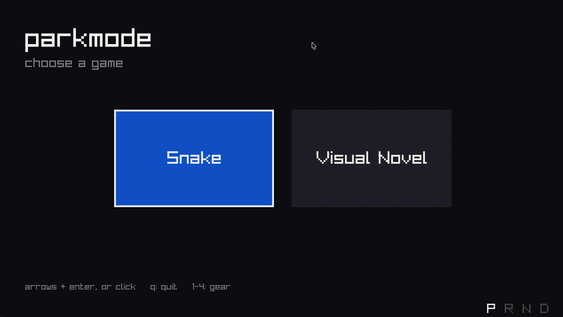
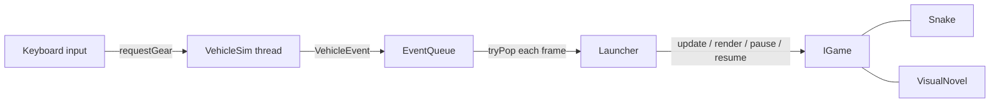

# parkmode

A small in-car style game platform in C++. It hosts games behind a common interface, runs a simulated vehicle on its own thread, and locks gameplay whenever the car isn't in Park.



## What it does

- **Launcher** with a home screen for picking games (keyboard arrow keys or mouse!)
- **Park lock**: shifting out of Park pauses whatever's running and shows a lock screen; shifting back resumes exactly where you left off! (it assumes anything OTHER than park is moving which is true technically)
- **Two games** built on the same interface:
  - **Snake**
  - **Visual novel** with Chinese and English dialogue, switchable live with one key

## How it works



- **`IGame` interface.** Every game implements `init`, `update`, `render`, `onPause`, and `onResume`. The launcher only knows about `IGame`, so adding a game is one line in `main.cpp` and doesn't touch the launcher or the lock logic.
- **Launcher state machine.** Three states: `Home`, `Running`, and `Locked`. On a gear change out of Park, it remembers the current state, pauses the game, and locks. On Park, it restores and resumes.
- **Vehicle thread.** `VehicleSim` runs on its own `std::thread` and simulates shift latency. It never touches rendering or input. The main thread asks for a gear through an atomic, and the sim reports the actual gear back through the queue.
- **Thread-safe event queue.** A mutex-guarded queue with a non-blocking `tryPop`, so the render loop never waits on the vehicle.
- **All raylib calls stay on the main thread.**
- **CJK text.** The visual novel walks UTF-8 by codepoint (so the typewriter effect never splits a character) and builds a glyph atlas at load time containing only the characters the script uses. It uses a pixel font drawn at integer scales with point filtering, to keep it crisp.

## Controls

| Key | Action |
|---|---|
| Arrows + Enter, or click | Pick a game |
| Esc | Back to home |
| Q | Quit (from home) |
| 1 / 2 / 3 / 4 | Shift to P / R / N / D |
| Space or click | Advance dialogue |
| L | Toggle 中文 / English (this only works in the visual novel proto) |

## Build

Requires CMake 3.20+ and a C++20 compiler i think. raylib is fetched automatically.

```bash
cmake -B build
cmake --build build
./build/parkmode
```

## Project layout

```
include/        headers (IGame, Launcher, EventQueue, VehicleSim)
include/games/  game headers
src/            platform code and main
src/games/      Snake, VisualNovel
assets/fonts/   pixel font + license
```

## Credits

- [raylib](https://www.raylib.com) for windowing, input, and drawing
- [Fusion Pixel Font](https://github.com/TakWolf/fusion-pixel-font) for the Chinese pixelated font to match the rest English, 10px (compared to normal 12px (?)) (SIL Open Font License 1.1)
